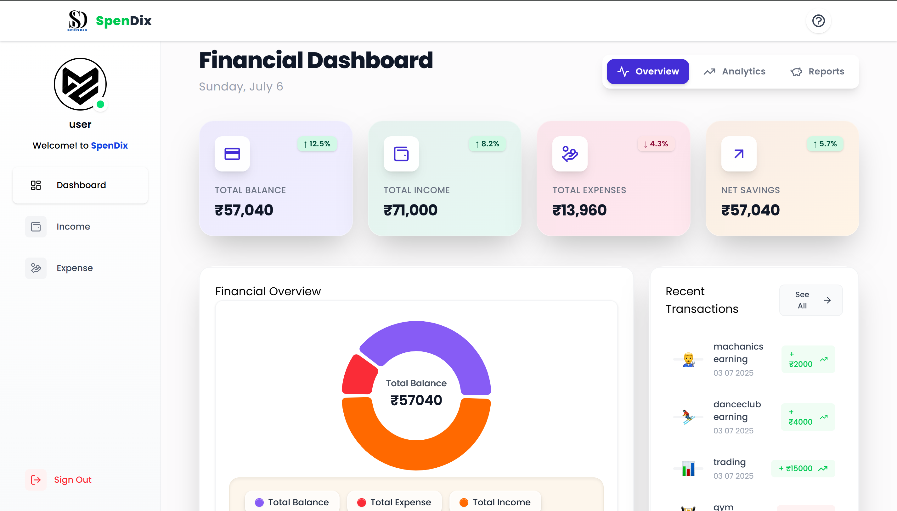
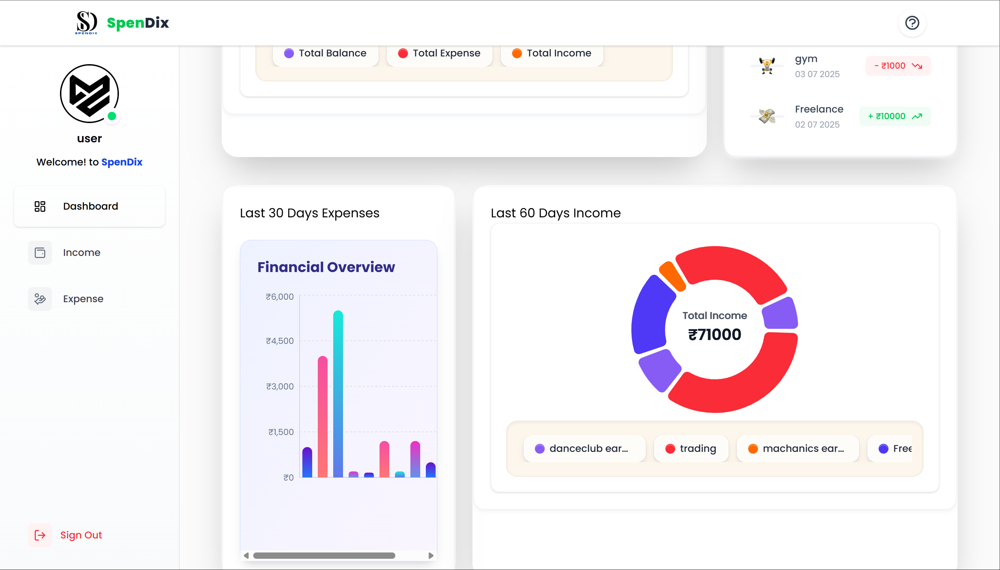
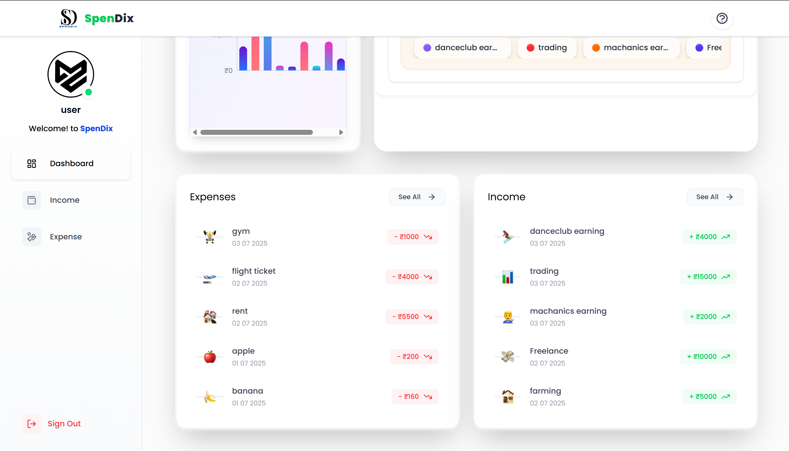
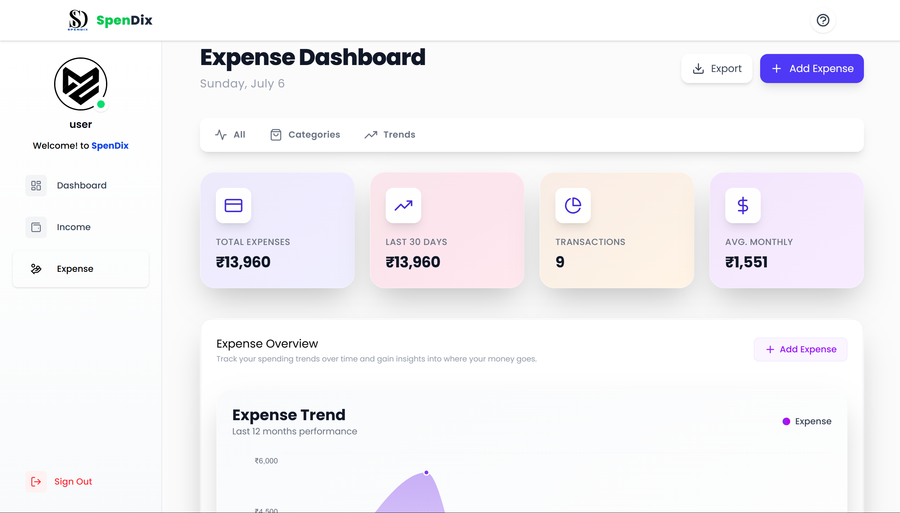
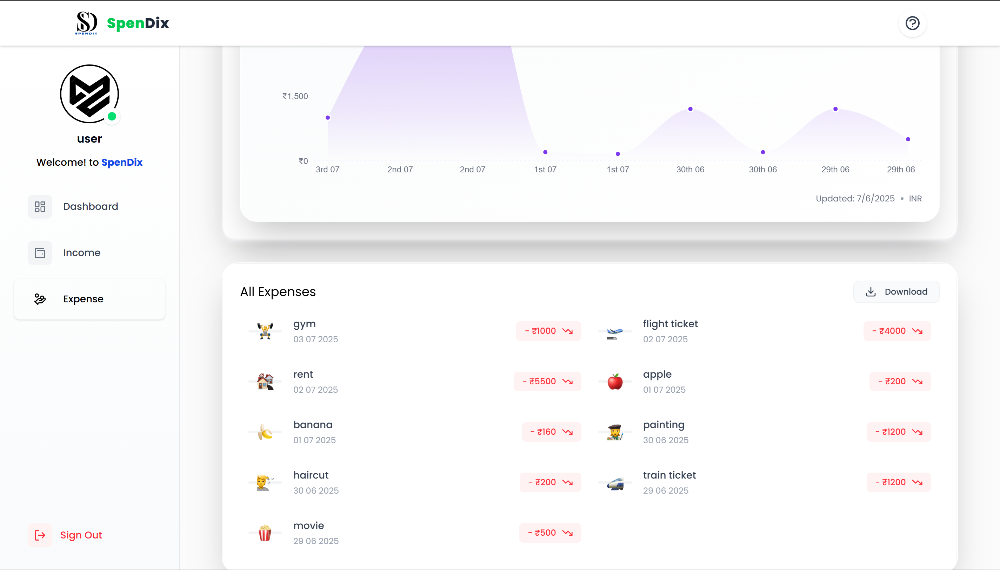
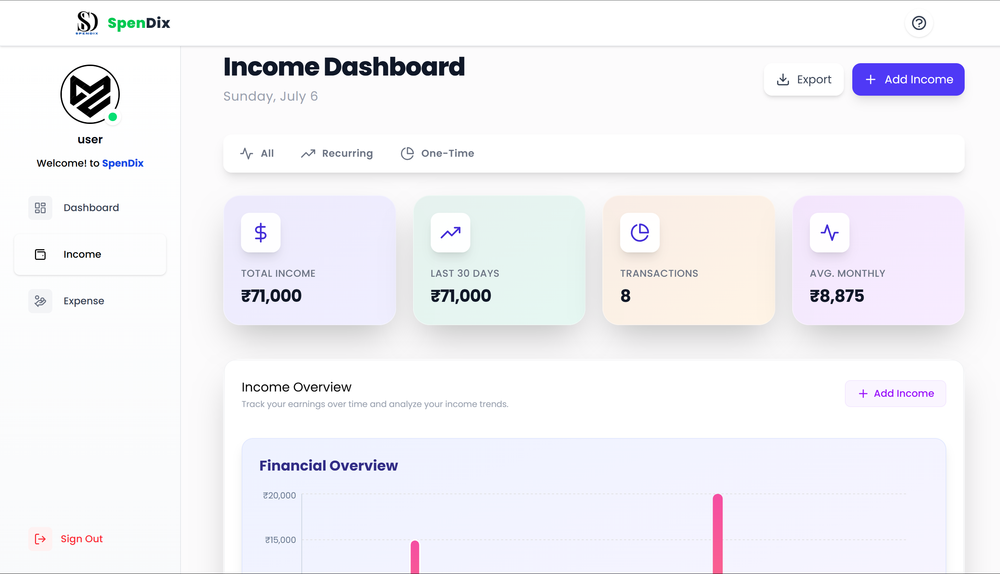
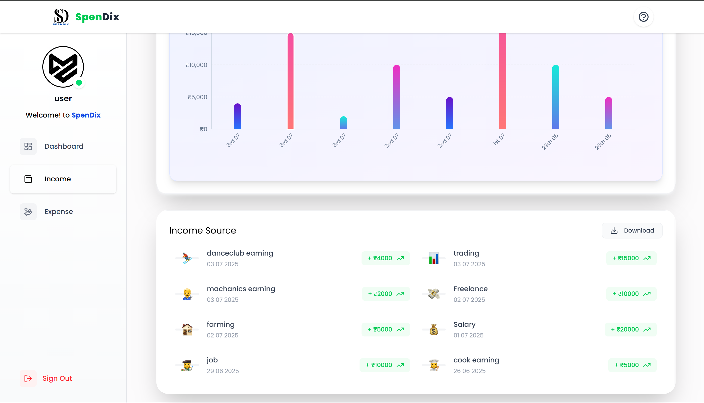

# 💸 Spendlix - Expense Tracker

Spendlix is a full-stack MERN application for tracking personal income and expenses with intuitive visualizations and a clean dashboard interface.

---

## 🔧 Tech Stack

**Frontend**: React, Axios, Recharts  
**Backend**: Node.js, Express, MongoDB, Mongoose  
**Auth**: JWT  
**File Upload**: Multer  
**Others**: XLSX, dotenv, CORS

---

## 📸 Screenshots

| Page           | Preview |
|----------------|---------|
| Dashboard1     |  |
| Dashboard2     |  |
| Dashboard3     |  |
| Expense1       |      |
| Expense2       |      |
| Income1        |        |
| Income2        |        |
| Login Page     |       |
| Sign Up Page   |    |

---

## 🗂️ Project Structure

### 📁 `frontend/`

```

frontend/
├── public/
├── src/
│   ├── assets/
│   ├── components/
│   │   ├── Cards/
│   │   │   ├── CharAvatar.jsx
│   │   │   ├── InfoCard.jsx
│   │   │   └── TransactionInfoCard.jsx
│   │   ├── Charts/
│   │   │   ├── CustomBarChart.jsx
│   │   │   ├── CustomLegend.jsx
│   │   │   ├── CustomLineChart.jsx
│   │   │   ├── CustomPieChart.jsx
│   │   │   └── CustomTooltip.jsx
│   │   ├── Dashboard/
│   │   │   ├── ExpenseTransactions.jsx
│   │   │   ├── FinanceOverview\.jsx
│   │   │   ├── Last30DaysExpenses.jsx
│   │   │   ├── RecentIncome.jsx
│   │   │   ├── RecentIncomeWithChart.jsx
│   │   │   └── RecentTransactions.jsx
│   │   ├── Expense/
│   │   │   ├── AddExpenseForm.jsx
│   │   │   ├── ExpenseList.jsx
│   │   │   └── ExpenseOverview\.jsx
│   │   ├── Income/
│   │   │   ├── AddIncomeForm.jsx
│   │   │   ├── IncomeList.jsx
│   │   │   └── IncomeOverview\.jsx
│   │   ├── Inputs/
│   │   │   ├── Input.jsx
│   │   │   └── ProfilePhotoSelector.jsx
│   │   ├── layouts/
│   │   │   ├── AuthLayout.jsx
│   │   │   ├── DashboardLayout.jsx
│   │   │   ├── Navbar.jsx
│   │   │   ├── SideMenu.jsx
│   │   │   ├── DeleteAlert.jsx
│   │   │   ├── EmojiPickerPopup.jsx
│   │   │   └── Modal.jsx
│   ├── context/
│   │   └── userContext.jsx
│   ├── hooks/
│   │   └── useUserAuth.jsx
│   ├── pages/
│   │   ├── Auth/
│   │   │   ├── Login.jsx
│   │   │   └── SignUp.jsx
│   │   ├── Dashboard/
│   │   │   └── Expense.jsx
│   │   ├── Home.jsx
│   │   └── Income.jsx
│   ├── utils/
│   │   ├── apiPaths.js
│   │   ├── axiosInstance.js
│   │   ├── data.js
│   │   ├── helper.js
│   │   └── uploadImage.js
│   ├── App.jsx
│   └── index.css

```

---

### 📁 `server/` (Backend)

```

server/
├── config/
│   └── db.js
├── controllers/
│   ├── authController.js
│   ├── dashboardController.js
│   ├── expenseController.js
│   └── incomeController.js
├── middleware/
│   ├── authMiddleware.js
│   └── uploadMiddleware.js
├── models/
│   ├── Expense.js
│   ├── Income.js
│   └── User.js
├── routes/
│   ├── authRoutes.js
│   ├── dashboardRoutes.js
│   ├── expenseRoutes.js
│   └── incomeRoutes.js
├── uploads/
├── .env
├── .gitignore
├── expense\_details.xlsx
├── server.js
├── package.json
└── package-lock.json

````


## ⚙️ Getting Started

### 1. Clone the repository

```bash
git clone https://github.com/sahilmd01/spendlix.git
cd spendlix
````

### 2. Install dependencies

#### Backend

```bash
cd server
npm install
```

#### Frontend

```bash
cd ../frontend
npm install
```

### 3. Setup environment variables

Create a `.env` file inside the `server/` directory:

```
PORT=5000
MONGO_URI=your_mongodb_connection_string
JWT_SECRET=your_jwt_secret
```

### 4. Run the application

#### Backend

```bash
cd server
npm run dev
```

#### Frontend

```bash
cd ../frontend
npm start
```

---

## ✨ Features

* JWT-based authentication
* Dashboard with dynamic charts (Pie, Line, Bar)
* Add and manage income and expenses
* Upload and manage profile avatars
* Export data as Excel
* Clean and responsive user interface

---

## 📝 License

MIT © [SAHIL](https://github.com/sahilmd01)

